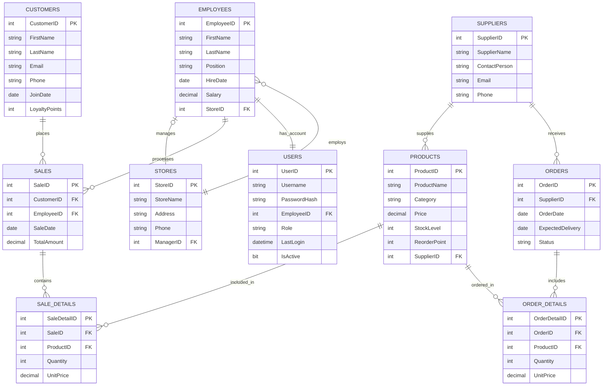
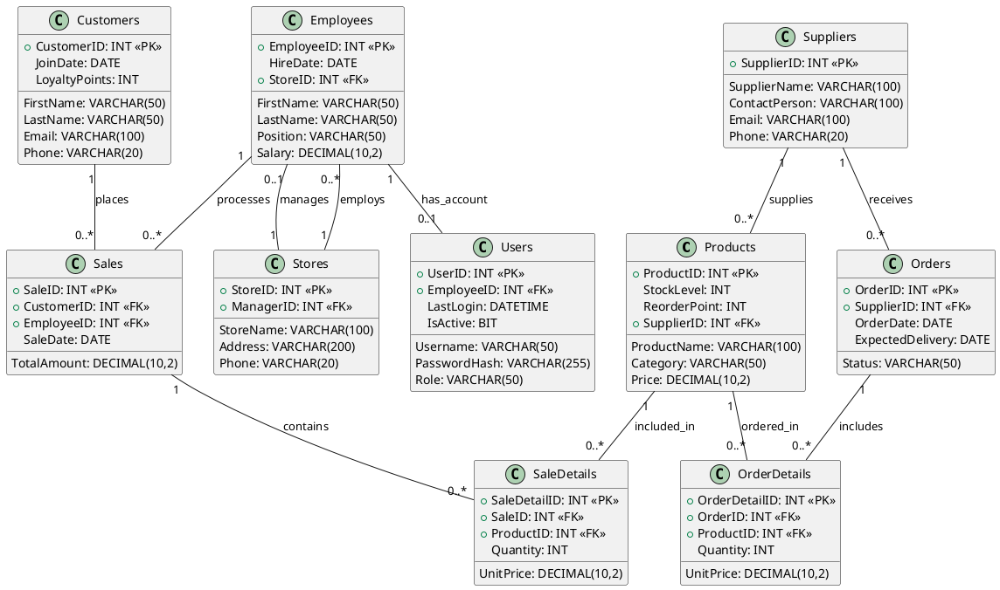

# Database Visualization Code

## ERD (Chen Notation) Visualization

### Option 1: Using Mermaid



### Option 2: Using PlantUML



## Relational Schema Visualization

### Option 1: Using Mermaid

```mermaid
graph TD
    subgraph Products
        ProductID[ProductID INT PK]
        ProductName[ProductName VARCHAR(100)]
        Category[Category VARCHAR(50)]
        Price[Price DECIMAL(10,2)]
        StockLevel[StockLevel INT]
        ReorderPoint[ReorderPoint INT]
        ProductSupplierID[SupplierID INT FK]
    end
    
    subgraph Customers
        CustomerID[CustomerID INT PK]
        FirstName[FirstName VARCHAR(50)]
        LastName[LastName VARCHAR(50)]
        Email[Email VARCHAR(100)]
        Phone[Phone VARCHAR(20)]
        JoinDate[JoinDate DATE]
        LoyaltyPoints[LoyaltyPoints INT]
    end
    
    subgraph Employees
        EmployeeID[EmployeeID INT PK]
        EmpFirstName[FirstName VARCHAR(50)]
        EmpLastName[LastName VARCHAR(50)]
        Position[Position VARCHAR(50)]
        HireDate[HireDate DATE]
        Salary[Salary DECIMAL(10,2)]
        EmpStoreID[StoreID INT FK]
    end
    
    subgraph Stores
        StoreID[StoreID INT PK]
        StoreName[StoreName VARCHAR(100)]
        Address[Address VARCHAR(200)]
        StorePhone[Phone VARCHAR(20)]
        ManagerID[ManagerID INT FK]
    end
    
    subgraph Sales
        SaleID[SaleID INT PK]
        SaleCustomerID[CustomerID INT FK]
        SaleEmployeeID[EmployeeID INT FK]
        SaleDate[SaleDate DATE]
        TotalAmount[TotalAmount DECIMAL(10,2)]
    end
    
    subgraph SaleDetails
        SaleDetailID[SaleDetailID INT PK]
        DetailSaleID[SaleID INT FK]
        DetailProductID[ProductID INT FK]
        Quantity[Quantity INT]
        UnitPrice[UnitPrice DECIMAL(10,2)]
    end
    
    subgraph Suppliers
        SupplierID[SupplierID INT PK]
        SupplierName[SupplierName VARCHAR(100)]
        ContactPerson[ContactPerson VARCHAR(100)]
        SupplierEmail[Email VARCHAR(100)]
        SupplierPhone[Phone VARCHAR(20)]
    end
    
    subgraph Orders
        OrderID[OrderID INT PK]
        OrderSupplierID[SupplierID INT FK]
        OrderDate[OrderDate DATE]
        ExpectedDelivery[ExpectedDelivery DATE]
        Status[Status VARCHAR(50)]
    end
    
    subgraph OrderDetails
        OrderDetailID[OrderDetailID INT PK]
        DetailOrderID[OrderID INT FK]
        OrderProductID[ProductID INT FK]
        OrderQuantity[Quantity INT]
        OrderUnitPrice[UnitPrice DECIMAL(10,2)]
    end
    
    subgraph Users
        UserID[UserID INT PK]
        Username[Username VARCHAR(50)]
        PasswordHash[PasswordHash VARCHAR(255)]
        UserEmployeeID[EmployeeID INT FK]
        Role[Role VARCHAR(50)]
        LastLogin[LastLogin DATETIME]
        IsActive[IsActive BIT]
    end
    
    ProductSupplierID --> SupplierID
    EmpStoreID --> StoreID
    ManagerID --> EmployeeID
    SaleCustomerID --> CustomerID
    SaleEmployeeID --> EmployeeID
    DetailSaleID --> SaleID
    DetailProductID --> ProductID
    OrderSupplierID --> SupplierID
    DetailOrderID --> OrderID
    OrderProductID --> ProductID
    UserEmployeeID --> EmployeeID
```

### Option 2: Using Online SQL Diagram Tools

For a more professional visualization of the relational schema, you can use online tools like:

1. **dbdiagram.io** - Copy and paste this code:

```
Table Products {
  ProductID int [pk]
  ProductName varchar(100) [not null]
  Category varchar(50) [not null]
  Price decimal(10,2) [not null]
  StockLevel int [not null, default: 0]
  ReorderPoint int [not null, default: 10]
  SupplierID int [ref: > Suppliers.SupplierID]
}

Table Customers {
  CustomerID int [pk]
  FirstName varchar(50) [not null]
  LastName varchar(50) [not null]
  Email varchar(100) [not null, unique]
  Phone varchar(20)
  JoinDate date [not null, default: `now()`]
  LoyaltyPoints int [not null, default: 0]
}

Table Employees {
  EmployeeID int [pk]
  FirstName varchar(50) [not null]
  LastName varchar(50) [not null]
  Position varchar(50) [not null]
  HireDate date [not null]
  Salary decimal(10,2)
  StoreID int [ref: > Stores.StoreID]
}

Table Stores {
  StoreID int [pk]
  StoreName varchar(100) [not null]
  Address varchar(200) [not null]
  Phone varchar(20)
  ManagerID int [ref: - Employees.EmployeeID]
}

Table Sales {
  SaleID int [pk]
  CustomerID int [ref: > Customers.CustomerID]
  EmployeeID int [ref: > Employees.EmployeeID]
  SaleDate date [not null]
  TotalAmount decimal(10,2) [not null]
}

Table SaleDetails {
  SaleDetailID int [pk]
  SaleID int [ref: > Sales.SaleID]
  ProductID int [ref: > Products.ProductID]
  Quantity int [not null]
  UnitPrice decimal(10,2) [not null]
}

Table Suppliers {
  SupplierID int [pk]
  SupplierName varchar(100) [not null]
  ContactPerson varchar(100)
  Email varchar(100)
  Phone varchar(20)
}

Table Orders {
  OrderID int [pk]
  SupplierID int [ref: > Suppliers.SupplierID]
  OrderDate date [not null]
  ExpectedDelivery date
  Status varchar(50) [not null]
}

Table OrderDetails {
  OrderDetailID int [pk]
  OrderID int [ref: > Orders.OrderID]
  ProductID int [ref: > Products.ProductID]
  Quantity int [not null]
  UnitPrice decimal(10,2) [not null]
}

Table Users {
  UserID int [pk]
  Username varchar(50) [not null, unique]
  PasswordHash varchar(255) [not null]
  EmployeeID int [ref: - Employees.EmployeeID]
  Role varchar(50) [not null]
  LastLogin datetime
  IsActive bit [not null, default: 1]
}
```

## Instructions for Visualization

1. **For Mermaid diagrams:**
   - Use an online Mermaid live editor like https://mermaid.live/
   - Paste the Mermaid code and render the diagram
   - Export as PNG or SVG for your presentation

2. **For PlantUML:**
   - Use PlantUML online editor at http://www.plantuml.com/plantuml/
   - Paste the PlantUML code and render the diagram
   - Export as PNG or SVG for your presentation

3. **For dbdiagram.io:**
   - Go to https://dbdiagram.io/
   - Paste the code and the diagram will be automatically generated
   - You can export as PNG or PDF for your presentation 