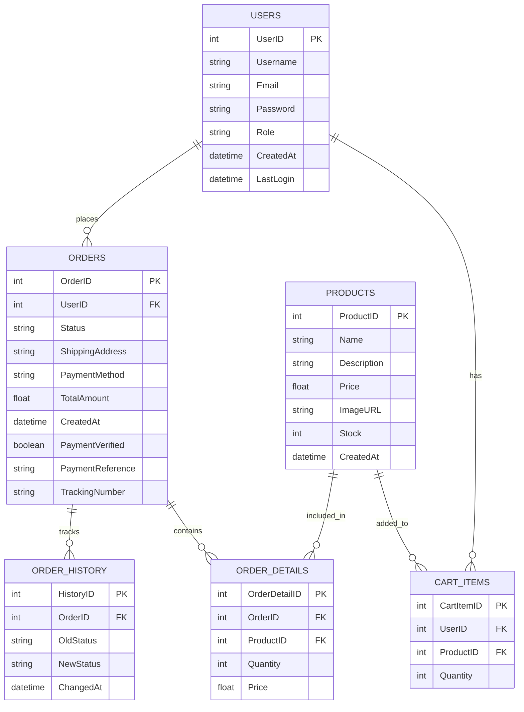
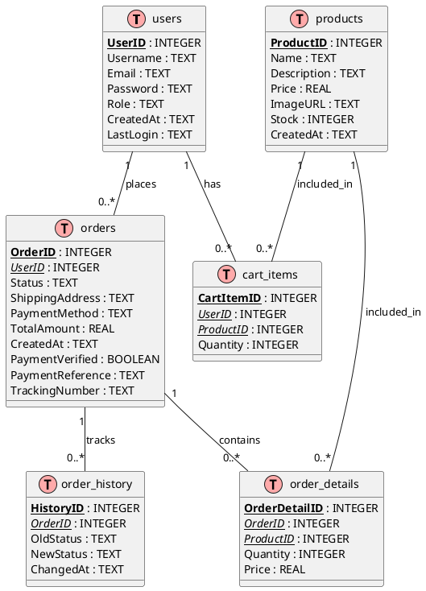

# ZaneMNL Database Diagram Code

## Mermaid ERD Code



## DBML (Database Markup Language) Code

```dbml
// ZaneMNL Cap Store Database Schema in DBML

Table users {
  UserID integer [primary key, increment]
  Username text [not null]
  Email text [not null, unique]
  Password text [not null]
  Role text [default: 'customer']
  CreatedAt text [default: `datetime('now')`]
  LastLogin text
}

Table products {
  ProductID integer [primary key, increment]
  Name text [not null, unique]
  Description text
  Price real [not null]
  ImageURL text
  Stock integer [not null, default: 0]
  CreatedAt text [default: `datetime('now')`]
  
  indexes {
    Name [unique]
    Price
  }
}

Table orders {
  OrderID integer [primary key, increment]
  UserID integer [not null, ref: > users.UserID]
  Status text [not null, default: 'pending']
  ShippingAddress text [not null]
  PaymentMethod text [not null]
  TotalAmount real [not null]
  CreatedAt text [default: `datetime('now')`]
  PaymentVerified boolean [not null, default: false]
  PaymentReference text
  TrackingNumber text
  
  indexes {
    UserID
    Status
  }
}

Table order_details {
  OrderDetailID integer [primary key, increment]
  OrderID integer [not null, ref: > orders.OrderID]
  ProductID integer [not null, ref: > products.ProductID]
  Quantity integer [not null]
  Price real [not null]
  
  indexes {
    OrderID
    ProductID
  }
}

Table cart_items {
  CartItemID integer [primary key, increment]
  UserID integer [not null, ref: > users.UserID]
  ProductID integer [not null, ref: > products.ProductID]
  Quantity integer [not null, default: 1]
  
  indexes {
    (UserID, ProductID) [unique]
  }
}

Table order_history {
  HistoryID integer [primary key, increment]
  OrderID integer [not null, ref: > orders.OrderID]
  OldStatus text [not null]
  NewStatus text [not null]
  ChangedAt text [default: `datetime('now')`]
  
  indexes {
    OrderID
  }
}

// Relationships (these are redundant with refs above, but included for clarity)
Ref: orders.UserID > users.UserID
Ref: cart_items.UserID > users.UserID
Ref: cart_items.ProductID > products.ProductID
Ref: order_details.OrderID > orders.OrderID
Ref: order_details.ProductID > products.ProductID
Ref: order_history.OrderID > orders.OrderID
```

## PlantUML Entity-Relationship Diagram Code



## Graphviz DOT Code for ERD

```dot
digraph ZaneMNL_ERD {
    rankdir=LR;
    node [shape=record, fontname="Arial", fontsize=10];
    edge [fontname="Arial", fontsize=9];
    
    /* Nodes (Tables) */
    users [label="{users|<pk> UserID : INTEGER PK\lUsername : TEXT\lEmail : TEXT\lPassword : TEXT\lRole : TEXT\lCreatedAt : TEXT\lLastLogin : TEXT\l}"];
    
    products [label="{products|<pk> ProductID : INTEGER PK\lName : TEXT\lDescription : TEXT\lPrice : REAL\lImageURL : TEXT\lStock : INTEGER\lCreatedAt : TEXT\l}"];
    
    orders [label="{orders|<pk> OrderID : INTEGER PK\l<fk_user> UserID : INTEGER FK\lStatus : TEXT\lShippingAddress : TEXT\lPaymentMethod : TEXT\lTotalAmount : REAL\lCreatedAt : TEXT\lPaymentVerified : BOOLEAN\lPaymentReference : TEXT\lTrackingNumber : TEXT\l}"];
    
    order_details [label="{order_details|<pk> OrderDetailID : INTEGER PK\l<fk_order> OrderID : INTEGER FK\l<fk_product> ProductID : INTEGER FK\lQuantity : INTEGER\lPrice : REAL\l}"];
    
    cart_items [label="{cart_items|<pk> CartItemID : INTEGER PK\l<fk_user> UserID : INTEGER FK\l<fk_product> ProductID : INTEGER FK\lQuantity : INTEGER\l}"];
    
    order_history [label="{order_history|<pk> HistoryID : INTEGER PK\l<fk_order> OrderID : INTEGER FK\lOldStatus : TEXT\lNewStatus : TEXT\lChangedAt : TEXT\l}"];
    
    /* Relationships */
    orders:fk_user -> users:pk [label="UserID"];
    order_details:fk_order -> orders:pk [label="OrderID"];
    order_details:fk_product -> products:pk [label="ProductID"];
    cart_items:fk_user -> users:pk [label="UserID"];
    cart_items:fk_product -> products:pk [label="ProductID"];
    order_history:fk_order -> orders:pk [label="OrderID"];
}
``` 