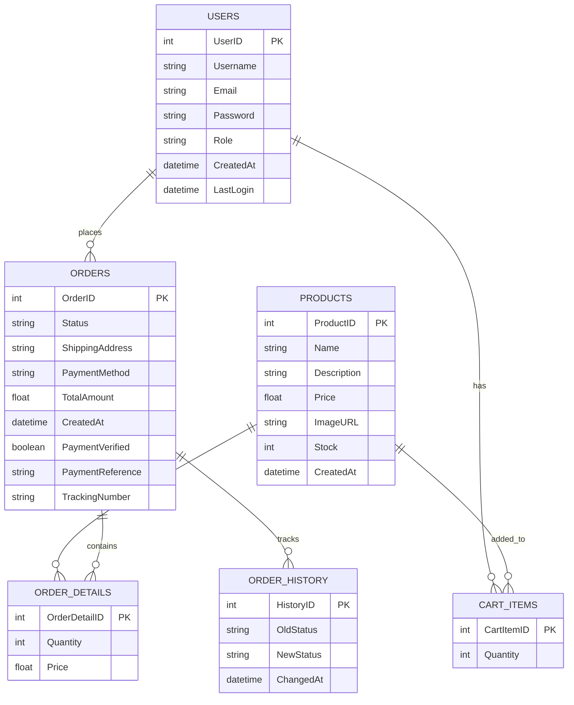

# ZaneMNL Database - Peter Chen ERD

Below is the Entity-Relationship Diagram for ZaneMNL Cap Store in Peter Chen notation:

## Alternative Textual Representation

In a more classical Peter Chen notation, the diagram would be represented with:

- **Entities**: Represented as rectangles (USERS, PRODUCTS, ORDERS, etc.)
- **Attributes**: Represented as ovals connected to their entities
- **Relationships**: Represented as diamonds connecting entities
- **Cardinalities**: Shown at the connection points (1, M, N)

The key relationships would be:
- A USER places many ORDERS (1:M)
- A USER has many CART_ITEMS (1:M)
- A PRODUCT can be added to many CART_ITEMS (1:M)
- A PRODUCT can be included in many ORDER_DETAILS (1:M)
- An ORDER contains many ORDER_DETAILS (1:M)
- An ORDER has many ORDER_HISTORY records (1:M)

Each entity would have its attributes connected to it (e.g., UserID, Username, Email, etc. for USERS). 